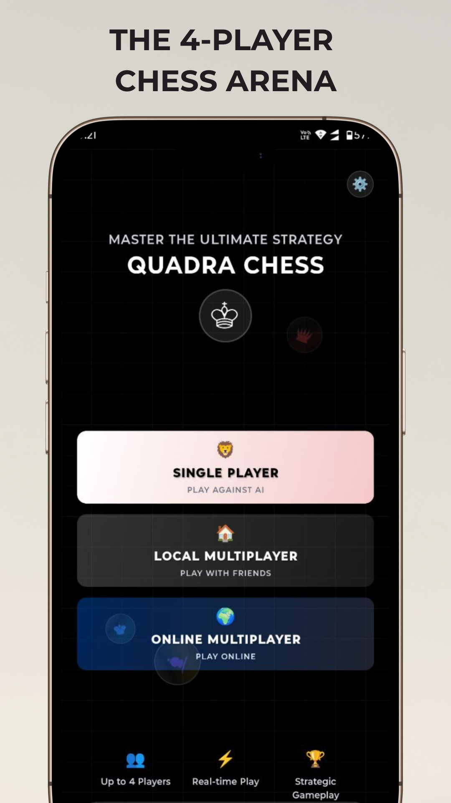
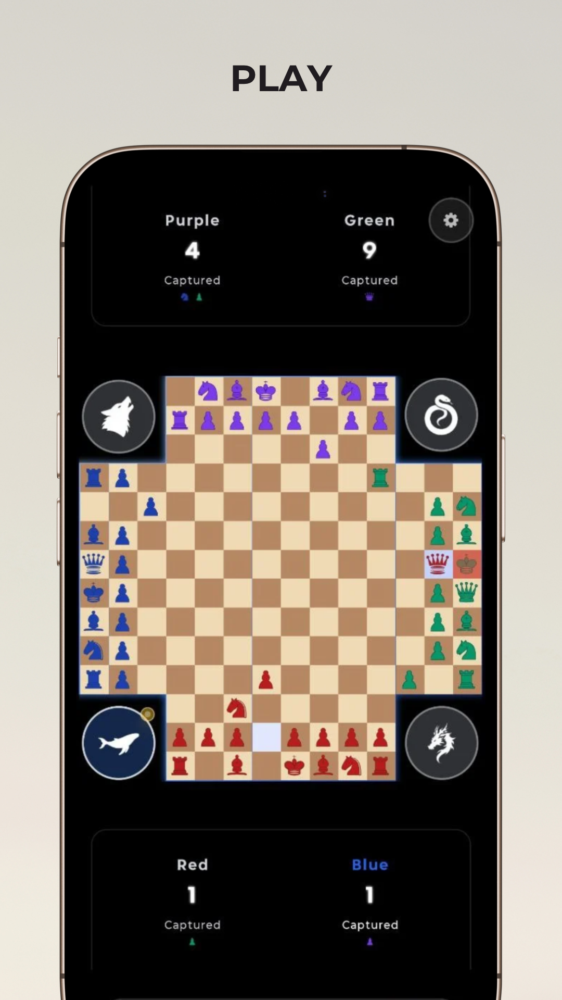
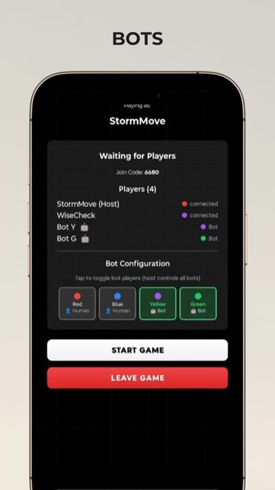
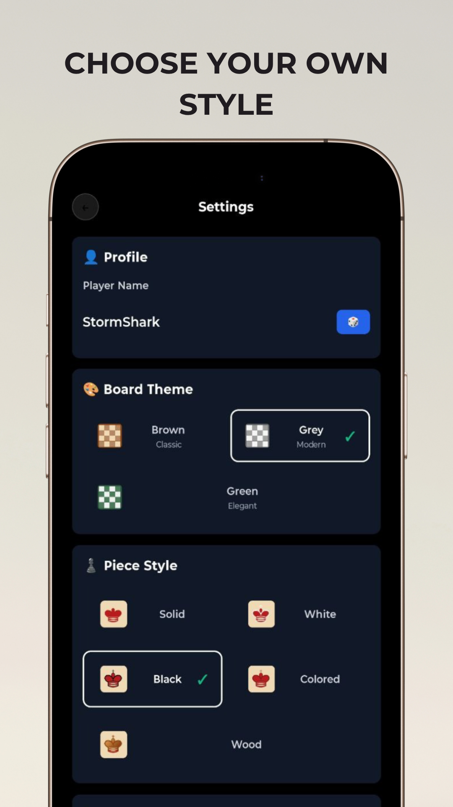

# ♟️ Quadrachess - Four Player Chess Game

<div align="center">


**A modern, multiplayer chess experience for 2-4 players**

[](https://reactnative.dev/)
[](https://expo.dev/)
[](https://www.typescriptlang.org/)
[](https://firebase.google.com/)
[](LICENSE)

</div>

## 🎮 Game Modes

### 🏠 **Single Player**
- Play against AI opponents
- Multiple difficulty levels
- Practice mode for learning

### 🌐 **Online Multiplayer**
- Real-time multiplayer via Firebase
- Global matchmaking
- Cross-platform compatibility

### 📱 **Local P2P**
- Peer-to-peer connections via WebRTC
- No internet required for local play
- Direct device-to-device communication

### 🎯 **Local Server**
- Host your own game server
- LAN multiplayer support
- Custom game rooms

## ✨ Key Features

- **🎨 Beautiful UI**: Modern, responsive design with smooth animations
- **🔊 Sound Effects**: Immersive audio feedback for all game actions
- **📱 Cross-Platform**: Works on iOS, Android, and Web
- **🎮 Multiple Game Modes**: Single player, online, P2P, and local server
- **♟️ Four Player Support**: Unique four-player chess variant
- **🎯 Smart AI**: Challenging computer opponents
- **📊 Game History**: Move tracking and replay functionality
- **🎨 Customizable**: Multiple themes and piece styles
- **⚡ Real-time Sync**: Instant move synchronization
- **🔒 Secure**: Firebase authentication and data protection

## 🚀 Quick Start

### Prerequisites

- Node.js (v14 or higher)
- Expo CLI
- iOS Simulator / Android Emulator (for mobile development)

### Installation

1. **Clone the repository**
   ```bash
   git clone https://github.com/yourusername/Quadrachess.git
   cd Quadrachess
   ```

2. **Install dependencies**
   ```bash
   npm install
   ```

3. **Start the development server**
   ```bash
   npm start
   ```

4. **Run on your preferred platform**
   ```bash
   # iOS
   npm run ios
   
   # Android
   npm run android
   
   # Web
   npm run web
   ```

## 📱 Screenshots

<div align="center">

### Home Screen



### Game Board



### Multiplayer Lobby


### Bot Gameplay



### Settings



</div>

## 🏗️ Architecture

### Tech Stack

- **Frontend**: React Native, Expo, TypeScript
- **State Management**: Redux Toolkit
- **Styling**: NativeWind (Tailwind CSS)
- **Backend**: Firebase (Firestore, Auth, Functions)
- **Real-time**: Socket.io, WebRTC
- **Animations**: React Native Reanimated
- **Audio**: Expo AV

### Project Structure

```
Quadrachess/
├── app/                    # Main application code
│   ├── (tabs)/            # Tab navigation screens
│   ├── components/         # Reusable UI components
│   └── services/          # Business logic services
├── assets/                # Images, sounds, fonts
├── config/                # Game configuration
├── state/                 # Redux store and slices
├── types/                 # TypeScript type definitions
└── services/              # External service integrations
```

## 🎯 Game Rules

Quadrachess follows traditional chess rules with these adaptations for four players:

- **Players**: Red, Blue, Yellow, Green (2-4 players)
- **Turn Order**: Red → Blue → Yellow → Green
- **Winning**: Eliminate opponent's king
- **Special Rules**: 
  - En passant works across all player boundaries
  - Castling follows standard rules
  - Pawn promotion available

## 🔧 Configuration

### Firebase Setup

1. Create a Firebase project
2. Enable Authentication, Firestore, and Functions
3. Update `firebase.config.js` with your credentials
4. Deploy Firestore security rules

### P2P Configuration

1. Configure WebRTC settings in `services/p2pService.ts`
2. Set up STUN/TURN servers for NAT traversal
3. Update signaling server URL in settings

## 📦 Build & Deploy

### Development Build

```bash
# Create development build
eas build --profile development --platform all
```

### Production Build

```bash
# Create production build
eas build --profile production --platform all
```

### App Store Deployment

```bash
# Submit to app stores
eas submit --platform all
```

## 🤝 Contributing

We welcome contributions! Please see our [Contributing Guidelines](CONTRIBUTING.md) for details.

### Development Setup

1. Fork the repository
2. Create a feature branch
3. Make your changes
4. Add tests if applicable
5. Submit a pull request

## 📄 License

This project is licensed under the MIT License - see the [LICENSE](LICENSE) file for details.

## 🙏 Acknowledgments

- Chess piece designs inspired by traditional chess sets
- Sound effects from royalty-free sources
- Firebase for backend infrastructure
- React Native community for excellent documentation

## 📞 Support

- **Issues**: [GitHub Issues](https://github.com/yourusername/Quadrachess/issues)
- **Discussions**: [GitHub Discussions](https://github.com/yourusername/Quadrachess/discussions)

## 🔗 Links

<!-- - **Website**: [Quadrachess.com](https://Quadrachess.com)
- **App Store**: [Download on App Store](https://apps.apple.com/app/Quadrachess) -->
- **Google Play**: [Get it on Google Play](https://play.google.com/store/apps/details?id=com.chess4d)

---

<div align="center">

**Made with ❤️ by JG**

[⭐ Star this repo](https://github.com/yourusername/Quadrachess) | [🐛 Report Bug](https://github.com/yourusername/Quadrachess/issues) | [💡 Request Feature](https://github.com/yourusername/Quadrachess/issues)

</div>
